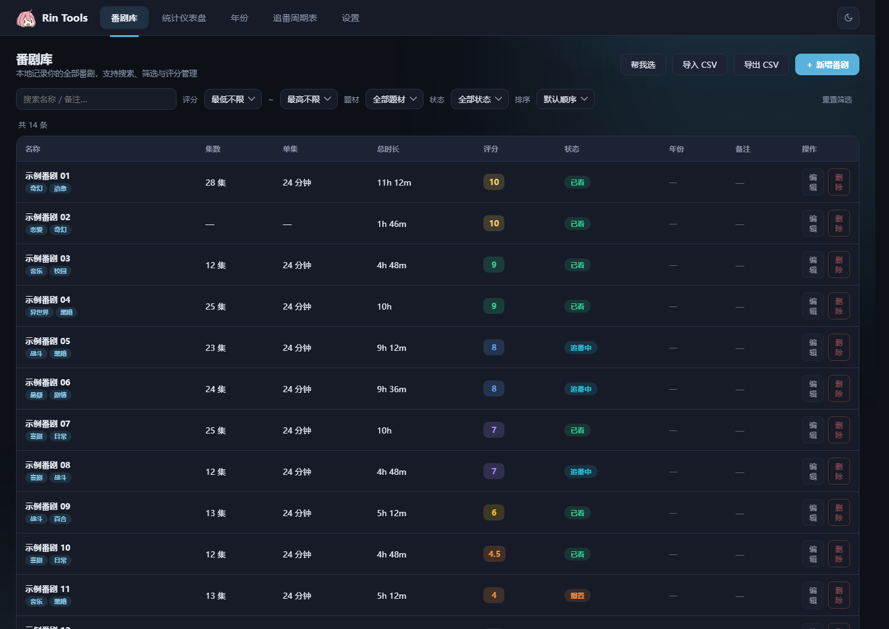
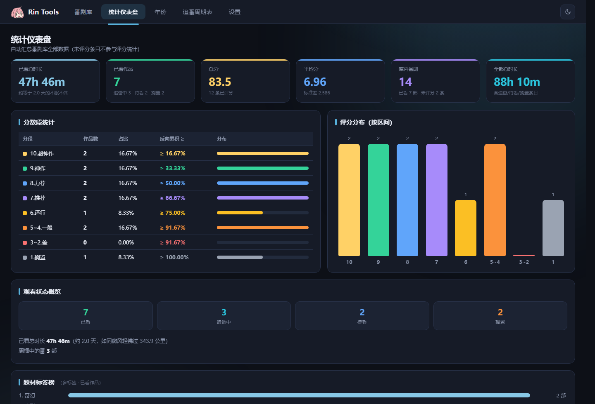
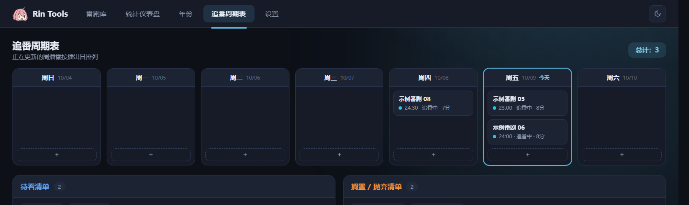

# Rin Tools

番剧管理，一个文件就够了。

**在线使用 →** https://tsuidylan.github.io/rin-tools/

**离线使用 →** 下载 [Rin-Tools.html](https://github.com/TsuiDylan/rin-tools/releases/latest/download/Rin-Tools.html)，双击打开即可，无需联网

数据保存在浏览器本地，换设备时用 JSON 备份迁移。

## 功能

- **番剧库** — 搜索、评分、题材标签、年份与备注，四种排序
- **追番周期表** — 按播出日排列本周番剧，条目可拖拽换位或排期
- **统计仪表盘** — 评分分布、题材标签榜、观看时长换算
- **待看 / 搁置清单** — 随时归档与调整
- **导入导出** — CSV 与 JSON 备份

## 界面

### 统计仪表盘

### 追番周期表

### 设置

---

仅供个人使用，禁止用于任何商业用途。
